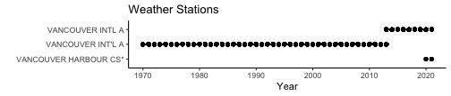

```r
## Get data
## get latest data using van-weather-import.R
## import saved data
vw_data <- read_csv("output/van-weather.csv") 
```

```
## 
## ── Column specification ──────────────────────────────────────────────────────────────────────────────────────────────
## cols(
##   Date = col_date(format = ""),
##   Year = col_double(),
##   Month = col_double(),
##   Day = col_double(),
##   Season = col_character(),
##   Season.Yr = col_double(),
##   Max.Temp = col_double(),
##   Min.Temp = col_double(),
##   Mean.Temp = col_double(),
##   Total.Precip = col_double(),
##   Station = col_character()
## )
```

```r
## convert Year, Month to factors for better charting
vw_data$Year <- as.factor(vw_data$Year)
vw_data$Month <- as.factor(vw_data$Month)
vw_data$Season <- as.factor(vw_data$Season)
## set Season order
vw_data$Season <- factor(vw_data$Season, levels=c("Winter","Spring","Summer","Fall"))
#levels(vw_data$Season)
```


```r
## Monthly precipitation for each month, each year
vw.precip.mth.yr <- vw_data %>% mutate(precip.day=ifelse(Total.Precip>0,1,0)) %>% 
  group_by(Year, Month) %>%
  summarize(ttl_precip=sum(Total.Precip, na.rm=TRUE),
            precip_days=sum(precip.day, na.rm=TRUE))
```

```
## `summarise()` has grouped output by 'Year'. You can override using the `.groups` argument.
```

```r
## Group by month for summary data by month of the year
vw.precip.mth <- vw.precip.mth.yr %>% group_by(Month) %>%
  summarize(ave_precip=mean(ttl_precip, na.rm=TRUE)) %>%
  mutate(pc_rank=percent_rank(ave_precip),
         pc=ave_precip/sum(ave_precip),
         rank=rank(desc(ave_precip)))

## filter for current year to overlay current year metrics on chart
vw.precip.mth.curr.yr <- vw.precip.mth.yr %>% filter(Year==year(Sys.Date()))
## need to have full 12 months for chart (even though some empty)
## get highest month with data in current year
fms <- max(as.numeric(vw.precip.mth.curr.yr$Month))+1
## create data frame for blank months
vw.precip.yr.future.mth <- data.frame(Year='2019',
                                      Month=c(fms:12),
                                       ttl_precip=NA,
                                      precip_days=NA)
## convert Month field in current yr from factor to integer for binding
vw.precip.mth.curr.yr$Month <- as.integer(vw.precip.mth.curr.yr$Month)
## add blank rows to current yr
vw.precip.mth.curr.yr <- bind_rows(vw.precip.mth.curr.yr,
                                    vw.precip.yr.future.mth) 

## YEARLY data
## Monthly precipitation for each month, each year
vw.precip.yr <- vw_data %>% mutate(precip.day=ifelse(Total.Precip>0,1,0)) %>% 
  group_by(Year) %>%
  summarize(ttl_precip=sum(Total.Precip, na.rm=TRUE),
            precip_days=sum(precip.day, na.rm=TRUE),
            ave_precip_pd=ttl_precip/365
            )

## Ave annual precip
vw.precip.yr.smry <- vw.precip.yr %>% 
  summarize(ave_precip=mean(ttl_precip, na.rm=TRUE),
            ave_precip_days=mean(precip_days),
            ave_precip_pd=ave_precip/365)

## Current yr extrapolation
recent_date <- max(vw_data$Date)
days_yr <- as.numeric(recent_date - floor_date(recent_date, unit='years'))
portion_yr <- days_yr/365
precip_yr_extrapolate <- vw.precip.yr[nrow(vw.precip.yr), 'ttl_precip']*(1/portion_yr)
precip_yr_extrapolate$Year <- factor(year(recent_date))
```


```r
## Monthly precipitation for each month, each year
vw.temp.mth.yr <- vw_data %>% 
  group_by(Year, Month) %>%
  summarize(ave_temp=mean(Mean.Temp, na.rm=TRUE),
            ave_max_temp=mean(Max.Temp, na.rm=TRUE),
            ave_min_temp=mean(Min.Temp, na.rm=TRUE),
            max_temp=max(Max.Temp, na.rm=TRUE),
            min_temp=min(Min.Temp, na.rm=TRUE))
```

```
## `summarise()` has grouped output by 'Year'. You can override using the `.groups` argument.
```

```r
#is.nan(vw.temp.mth.yr$ave_min_temp)
#vw.temp.mth.yr %>% filter(min_temp==-Inf)
## need to clean up missing values
## even with na.rm used above, if there are only NA for a given month, 
##  it will return NaN for mean and Inf or -Inf for min/max
## clean up
vw.temp.mth.yr <- vw.temp.mth.yr %>% mutate(
  ave_temp=ifelse(is.nan(ave_temp),NA,ave_temp),
  ave_max_temp=ifelse(is.nan(ave_max_temp),NA,ave_max_temp),
  ave_min_temp=ifelse(is.nan(ave_min_temp),NA,ave_min_temp),
  max_temp=ifelse(max_temp==-Inf|min_temp==Inf,NA, max_temp),
  min_temp=ifelse(min_temp==-Inf|max_temp==Inf,NA, min_temp)
)

## Monthly average temp across years
vw.temp.mth <- vw.temp.mth.yr %>% group_by(Month) %>%
  summarize(ave_temp=mean(ave_temp, na.rm=TRUE),
            ave_max_temp=mean(ave_max_temp, na.rm=TRUE),
            ave_min_temp=mean(ave_min_temp, na.rm=TRUE)) %>%
  mutate(pc_rank=percent_rank(ave_temp),
         rank=rank(desc(ave_temp)))

## filter for current year to overlay current year metrics on chart
vw.temp.mth.curr.yr <- vw.temp.mth.yr %>% filter(Year==year(Sys.Date()))
## need to have full 12 months for chart (even though some empty)
## get highest month with data in current year
fms <- max(as.numeric(vw.temp.mth.curr.yr$Month))+1
## create data frame for blank months
vw.temp.yr.future.mth <- data.frame(Year=year(Sys.Date()),
                                      Month=c(fms:12))
## convert Month field in current yr from factor to integer for binding
vw.temp.mth.curr.yr$Year <- as.integer(vw.temp.mth.curr.yr$Year)
vw.temp.mth.curr.yr$Month <- as.integer(vw.temp.mth.curr.yr$Month)

## add blank rows to current yr
vw.temp.mth.curr.yr <- bind_rows(vw.temp.mth.curr.yr,
                                    vw.temp.yr.future.mth) 

## YEARLY temperature summary 
vw.temp.yr <- vw_data %>% 
  group_by(Year) %>%
  summarize(ave_temp=mean(Mean.Temp, na.rm=TRUE),
            ave_max_temp=mean(Max.Temp, na.rm=TRUE),
            ave_min_temp=mean(Min.Temp, na.rm=TRUE),
            max_temp=max(Max.Temp, na.rm=TRUE),
            min_temp=min(Min.Temp, na.rm=TRUE))
```

Recent - 30d
===================================================================


```r
## recent data
num_days <- 30
vw_data_rec <- vw_data %>% filter(Date>=max(vw_data$Date)-num_days)
```


```r
## use this space to create a synopsis that can be printed below
synopsis_precip <- if(sum(vw_data_rec$Total.Precip, na.rm=TRUE)>quantile(vw.precip.mth.yr$ttl_precip, 0.75)){
  "WET" 
} else if(sum(vw_data_rec$Total.Precip, na.rm=TRUE)>quantile(vw.precip.mth.yr$ttl_precip, 0.25)) {
  "MILDLY WET"
} else {
  "DRY"
}

synopsis_temp <- if(max(vw_data_rec$Max.Temp, na.rm=TRUE)>quantile(vw.temp.mth.yr$max_temp, 0.75)){
  "HOT" 
} else if(sum(vw_data_rec$Max.Temp, na.rm=TRUE)>quantile(vw.temp.mth.yr$max_temp, 0.25)) {
  "WARM"
} else {
  "COOL"
}
```

Weather has been DRY and HOT between 2021-07-02 and 2021-08-01.

Column {data-width=200}
-----------------------------------------------------------------------

### Rainy Days


```r
## DAYS OF RAIN: calc number of days of precip
precip_days <- nrow(vw_data_rec[vw_data_rec$Total.Precip>0,])

valueBox(prettyNum(max(precip_days, na.rm=TRUE), big.mark=','),
         href='')
```

<!--html_preserve--><span class="value-output" data-href="">0</span><!--/html_preserve-->

### Total Recent Precipitation (cm)


```r
#valueBox(prettyNum(sum(vw_data_rec$Total.Precip, na.rm=TRUE), big.mark=','),
#         href='#trends')
```


```r
s1 <- quantile(vw.precip.mth.yr$ttl_precip, 0.75)
s2 <- max(vw.precip.mth.yr$ttl_precip)
w1 <- quantile(vw.precip.mth.yr$ttl_precip, 0.25)
w2 <- quantile(vw.precip.mth.yr$ttl_precip, 0.74)
d1 <- min(vw.precip.mth.yr$ttl_precip, na.rm=TRUE)
d2 <- quantile(vw.precip.mth.yr$ttl_precip, 0.24)

gauge(value=sum(vw_data_rec$Total.Precip, na.rm=TRUE),
      min=d1,
      max=s2,
      sectors=gaugeSectors(
        danger=c(s1[[1]],s2),
        warning=c(w1[[1]],s1[[1]]),
        success=c(d1,w1[[1]])
        ),
      symbol='cm'
      )
```

```
## PhantomJS not found. You can install it with webshot::install_phantomjs(). If it is installed, please make sure the phantomjs executable can be found via the PATH variable.
```

```
## Error in path.expand(path): invalid 'path' argument
```

### Highest Recent Temp. (c)


```r
#valueBox(prettyNum(max(vw_data_rec$Max.Temp, na.rm=TRUE), big.mark=','),
#         href='#trends')

s1 <- quantile(vw.temp.mth.yr$max_temp, 0.75, na.rm=TRUE)
s2 <- max(vw.temp.mth.yr$max_temp, na.rm=TRUE)
w1 <- quantile(vw.temp.mth.yr$max_temp, 0.25, na.rm=TRUE)
w2 <- quantile(vw.temp.mth.yr$max_temp, 0.74, na.rm=TRUE)
d1 <- min(vw.temp.mth.yr$max_temp, na.rm=TRUE)
d2 <- quantile(vw.temp.mth.yr$max_temp, 0.24, na.rm=TRUE)

gauge(value=max(vw_data_rec$Max.Temp, na.rm=TRUE),
      min=d1,
      max=s2,
      sectors=gaugeSectors(
        danger=c(s1[[1]],s2),
        warning=c(w1[[1]],s1[[1]]),
        success=c(d1,w1[[1]])
        ),
      symbol='c'
      )
```

```
## PhantomJS not found. You can install it with webshot::install_phantomjs(). If it is installed, please make sure the phantomjs executable can be found via the PATH variable.
```

```
## Error in path.expand(path): invalid 'path' argument
```

### Lowest Recent Temp. (c)


```r
#valueBox(prettyNum(min(vw_data_rec$Min.Temp, na.rm=TRUE), big.mark=','),
#         href='#trends')

s1 <- quantile(vw.temp.mth.yr$min_temp, 0.75)
s2 <- max(vw.temp.mth.yr$min_temp, na.rm=TRUE)
w1 <- quantile(vw.temp.mth.yr$min_temp, 0.25)
w2 <- quantile(vw.temp.mth.yr$min_temp, 0.74)
d1 <- min(vw.temp.mth.yr$min_temp, na.rm=TRUE)
d2 <- quantile(vw.temp.mth.yr$min_temp, 0.24)

gauge(value=min(vw_data_rec$Min.Temp, na.rm=TRUE),
      min=d1,
      max=s2,
      sectors=gaugeSectors(
        danger=c(s1[[1]],s2),
        warning=c(w1[[1]],s1[[1]]),
        success=c(d1,w1[[1]])
        ),
      symbol='c'
      )
```

```
## PhantomJS not found. You can install it with webshot::install_phantomjs(). If it is installed, please make sure the phantomjs executable can be found via the PATH variable.
```

```
## Error in path.expand(path): invalid 'path' argument
```

### Recent date range

2021-07-02 to 2021-08-01 <br />
30 days <br />
[Source info](van-weather-dashboard.html#source)

Column {data-width=400}
-----------------------------------------------------------------------

### Recent Precipitation


```r
p1 <- vw_data_rec %>%
  ggplot(aes(x=Date, y=Total.Precip))+geom_col(fill=precip_color)+
  scale_y_continuous(expand=expansion(add=c(0,2)))+
  labs(x="", y="Total Daily Precipitation")

ggplotly(p1)
```

```
## PhantomJS not found. You can install it with webshot::install_phantomjs(). If it is installed, please make sure the phantomjs executable can be found via the PATH variable.
```

```
## Error in path.expand(path): invalid 'path' argument
```

### Monthly Precipation (red diamonds = current yr)


```r
## Ave precip by month ####
# chart.title <- "Average Precipitation by Month"
# sub.title <- "(red marker is curr. yr.)"
# p2 <- ggplot(vw.precip.mth, aes(x=Month, y=ave_precip))+geom_col()+
#   geom_point(data=vw.precip.mth.curr.yr, aes(x=Month, y=ttl_precip),shape=18, color='red', size=2.5)+
#   scale_y_continuous(expand=c(0.1,0.1))+
#   labs(title=chart.title, subtitle=sub.title, x="", y="Ave. Precipitation")
# ggplotly(p2)


## Range in precipitation by month ####
chart.title <- "Monthly Precip. Ranges during Period"
sub.title <- "(red markers: current yr.)"
p2 <- ggplot(vw.precip.mth.yr, aes(x=Month, y=ttl_precip))+geom_boxplot(fill=precip_color)+
  geom_point(data=vw.precip.mth.curr.yr, aes(x=Month, y=ttl_precip),shape=18, color='red', size=2.5)+
  labs(x="", y="Mthly Precipitation")
ggplotly(p2)
```

```
## PhantomJS not found. You can install it with webshot::install_phantomjs(). If it is installed, please make sure the phantomjs executable can be found via the PATH variable.
```

```
## Error in path.expand(path): invalid 'path' argument
```

Column {data-width=400}
-----------------------------------------------------------------------

### Recent Temperature (dot = daily ave.; lines = period aves.)


```r
t1 <-  vw_data_rec %>%
  ggplot(aes(x=Date))+ ## if initial y aesthetic included, will show in each overlay in plotly
  geom_col(aes(y=Max.Temp), fill=warm_color, color='white')+
  geom_col(aes(y=Mean.Temp), fill=cool_color, color='white')+
  geom_point(aes(y=Mean.Temp), color='black', size=2)+
  geom_col(aes(y=Min.Temp), fill='white')+
  geom_hline(yintercept=mean(vw_data_rec$Max.Temp), linetype='dotted', color=warm_color)+
  geom_hline(yintercept=mean(vw_data_rec$Mean.Temp), linetype='dotted', color='grey50')+
  geom_hline(yintercept=mean(vw_data_rec$Min.Temp), linetype='dotted', color=cool_color)+
  scale_y_continuous(expand=expansion(add=c(0,2)))+
  scale_x_date(expand=c(0,0))+
  theme(panel.grid = element_blank())+
  #theme(panel.background = element_rect(fill='white'))+
  #theme(panel.grid.major.y = element_blank(),
        #panel.grid.minor.y = element_blank())+ ## hiding horizontal grid due to white bar blocking
  labs(x="", y="Max Daily Temperature")

ggplotly(t1)
```

```
## PhantomJS not found. You can install it with webshot::install_phantomjs(). If it is installed, please make sure the phantomjs executable can be found via the PATH variable.
```

```
## Error in path.expand(path): invalid 'path' argument
```

### Monthly Temperature Comp. (red diamonds = current yr)


```r
## Distribution of temperature by month ####

## Range in temperature by month ####
chart.title <- "Monthly Temp. Ranges during Period (Red markers: current yr.)"
t2 <- ggplot(vw.temp.mth.yr, aes(x=Month, y=ave_temp))+geom_boxplot(fill=cool_color)+
  geom_point(data=vw.temp.mth.curr.yr, aes(x=Month, y=ave_temp),shape=18, color='red', size=2.5)+
  labs(x="", y="Ave. Temperature") ## subtitle doesn't work with ggplotly
ggplotly(t2)
```

```
## PhantomJS not found. You can install it with webshot::install_phantomjs(). If it is installed, please make sure the phantomjs executable can be found via the PATH variable.
```

```
## Error in path.expand(path): invalid 'path' argument
```

90 days
===================================================================


```r
## recent data
num_days <- 90
vw_data_rec <- vw_data %>% filter(Date>=max(vw_data$Date)-num_days)
```


```r
## use this space to create a synopsis that can be printed below
synopsis_precip <- if(sum(vw_data_rec$Total.Precip, na.rm=TRUE)>quantile(vw.precip.mth.yr$ttl_precip, 0.75)){
  "WET" 
} else if(sum(vw_data_rec$Total.Precip, na.rm=TRUE)>quantile(vw.precip.mth.yr$ttl_precip, 0.25)) {
  "MILDLY WET"
} else {
  "DRY"
}

synopsis_temp <- if(max(vw_data_rec$Max.Temp, na.rm=TRUE)>quantile(vw.temp.mth.yr$max_temp, 0.75)){
  "HOT" 
} else if(sum(vw_data_rec$Max.Temp, na.rm=TRUE)>quantile(vw.temp.mth.yr$max_temp, 0.25)) {
  "WARM"
} else {
  "COOL"
}
```

Weather has been MILDLY WET and HOT between 2021-05-03 and 2021-08-01.

Column {data-width=200}
-----------------------------------------------------------------------

### Rainy Days


```r
## DAYS OF RAIN: calc number of days of precip
precip_days <- nrow(vw_data_rec[vw_data_rec$Total.Precip>0,])

valueBox(prettyNum(max(precip_days, na.rm=TRUE), big.mark=','),
         href='')
```

<!--html_preserve--><span class="value-output" data-href="">18</span><!--/html_preserve-->

### Total Precipitation (cm)


```r
#valueBox(prettyNum(sum(vw_data_rec$Total.Precip, na.rm=TRUE), big.mark=','),
#         href='#trends')
```


```r
s1 <- quantile(vw.precip.mth.yr$ttl_precip, 0.75)
s2 <- max(vw.precip.mth.yr$ttl_precip)
w1 <- quantile(vw.precip.mth.yr$ttl_precip, 0.25)
w2 <- quantile(vw.precip.mth.yr$ttl_precip, 0.74)
d1 <- min(vw.precip.mth.yr$ttl_precip, na.rm=TRUE)
d2 <- quantile(vw.precip.mth.yr$ttl_precip, 0.24)

gauge(value=sum(vw_data_rec$Total.Precip, na.rm=TRUE),
      min=d1,
      max=s2,
      sectors=gaugeSectors(
        danger=c(s1[[1]],s2),
        warning=c(w1[[1]],s1[[1]]),
        success=c(d1,w1[[1]])
        ),
      symbol='cm'
      )
```

```
## PhantomJS not found. You can install it with webshot::install_phantomjs(). If it is installed, please make sure the phantomjs executable can be found via the PATH variable.
```

```
## Error in path.expand(path): invalid 'path' argument
```

### Highest Temp. (c)


```r
#valueBox(prettyNum(max(vw_data_rec$Max.Temp, na.rm=TRUE), big.mark=','),
#         href='#trends')

s1 <- quantile(vw.temp.mth.yr$max_temp, 0.75, na.rm=TRUE)
s2 <- max(vw.temp.mth.yr$max_temp, na.rm=TRUE)
w1 <- quantile(vw.temp.mth.yr$max_temp, 0.25, na.rm=TRUE)
w2 <- quantile(vw.temp.mth.yr$max_temp, 0.74, na.rm=TRUE)
d1 <- min(vw.temp.mth.yr$max_temp, na.rm=TRUE)
d2 <- quantile(vw.temp.mth.yr$max_temp, 0.24, na.rm=TRUE)

gauge(value=max(vw_data_rec$Max.Temp, na.rm=TRUE),
      min=d1,
      max=s2,
      sectors=gaugeSectors(
        danger=c(s1[[1]],s2),
        warning=c(w1[[1]],s1[[1]]),
        success=c(d1,w1[[1]])
        ),
      symbol='c'
      )
```

```
## PhantomJS not found. You can install it with webshot::install_phantomjs(). If it is installed, please make sure the phantomjs executable can be found via the PATH variable.
```

```
## Error in path.expand(path): invalid 'path' argument
```

### Lowest Temp. (c)


```r
#valueBox(prettyNum(min(vw_data_rec$Min.Temp, na.rm=TRUE), big.mark=','),
#         href='#trends')

s1 <- quantile(vw.temp.mth.yr$min_temp, 0.75)
s2 <- max(vw.temp.mth.yr$min_temp, na.rm=TRUE)
w1 <- quantile(vw.temp.mth.yr$min_temp, 0.25)
w2 <- quantile(vw.temp.mth.yr$min_temp, 0.74)
d1 <- min(vw.temp.mth.yr$min_temp, na.rm=TRUE)
d2 <- quantile(vw.temp.mth.yr$min_temp, 0.24)

gauge(value=min(vw_data_rec$Min.Temp, na.rm=TRUE),
      min=d1,
      max=s2,
      sectors=gaugeSectors(
        danger=c(s1[[1]],s2),
        warning=c(w1[[1]],s1[[1]]),
        success=c(d1,w1[[1]])
        ),
      symbol='c'
      )
```

```
## PhantomJS not found. You can install it with webshot::install_phantomjs(). If it is installed, please make sure the phantomjs executable can be found via the PATH variable.
```

```
## Error in path.expand(path): invalid 'path' argument
```

### Date range

2021-05-03 to 2021-08-01 <br />
90 days <br />
[Source info](van-weather-dashboard.html#source)

Column {data-width=400}
-----------------------------------------------------------------------

### Precipitation


```r
p1 <- vw_data_rec %>%
  ggplot(aes(x=Date, y=Total.Precip))+geom_col(fill=precip_color)+
  scale_y_continuous(expand=expansion(add=c(0,2)))+
  labs(x="", y="Total Daily Precipitation")

ggplotly(p1)
```

```
## PhantomJS not found. You can install it with webshot::install_phantomjs(). If it is installed, please make sure the phantomjs executable can be found via the PATH variable.
```

```
## Error in path.expand(path): invalid 'path' argument
```

### Monthly Precipation (red diamonds = current yr)


```r
## Ave precip by month ####
# chart.title <- "Average Precipitation by Month"
# sub.title <- "(red marker is curr. yr.)"
# p2 <- ggplot(vw.precip.mth, aes(x=Month, y=ave_precip))+geom_col()+
#   geom_point(data=vw.precip.mth.curr.yr, aes(x=Month, y=ttl_precip),shape=18, color='red', size=2.5)+
#   scale_y_continuous(expand=c(0.1,0.1))+
#   labs(title=chart.title, subtitle=sub.title, x="", y="Ave. Precipitation")
# ggplotly(p2)


## Range in precipitation by month ####
chart.title <- "Monthly Precip. Ranges during Period"
sub.title <- "(red markers: current yr.)"
p2 <- ggplot(vw.precip.mth.yr, aes(x=Month, y=ttl_precip))+geom_boxplot(fill=precip_color)+
  geom_point(data=vw.precip.mth.curr.yr, aes(x=Month, y=ttl_precip),shape=18, color='red', size=2.5)+
  labs(x="", y="Mthly Precipitation")
ggplotly(p2)
```

```
## PhantomJS not found. You can install it with webshot::install_phantomjs(). If it is installed, please make sure the phantomjs executable can be found via the PATH variable.
```

```
## Error in path.expand(path): invalid 'path' argument
```

Column {data-width=400}
-----------------------------------------------------------------------

### Temperature (dot = daily ave.; lines = period aves.)


```r
t1 <-  vw_data_rec %>%
  ggplot(aes(x=Date))+ ## if initial y aesthetic included, will show in each overlay in plotly
  geom_col(aes(y=Max.Temp), fill=warm_color, color='white')+
  geom_col(aes(y=Mean.Temp), fill=cool_color, color='white')+
  geom_point(aes(y=Mean.Temp), color='black', size=1)+
  geom_col(aes(y=Min.Temp), fill='white')+
  geom_hline(yintercept=mean(vw_data_rec$Max.Temp), linetype='dotted', color=warm_color)+
  geom_hline(yintercept=mean(vw_data_rec$Mean.Temp), linetype='dotted', color='grey50')+
  geom_hline(yintercept=mean(vw_data_rec$Min.Temp), linetype='dotted', color=cool_color)+
  scale_y_continuous(expand=expansion(add=c(0,2)))+
  scale_x_date(expand=c(0,0))+
  theme(panel.grid = element_blank())+
  #theme(panel.background = element_rect(fill='white'))+
  #theme(panel.grid.major.y = element_blank(),
        #panel.grid.minor.y = element_blank())+ ## hiding horizontal grid due to white bar blocking
  labs(x="", y="Max Daily Temperature")

ggplotly(t1)
```

```
## PhantomJS not found. You can install it with webshot::install_phantomjs(). If it is installed, please make sure the phantomjs executable can be found via the PATH variable.
```

```
## Error in path.expand(path): invalid 'path' argument
```

### Monthly Temperature Comp. (red diamonds = current yr)


```r
## Distribution of temperature by month ####

## Range in temperature by month ####
chart.title <- "Monthly Temp. Ranges during Period (Red markers: current yr.)"
t2 <- ggplot(vw.temp.mth.yr, aes(x=Month, y=ave_temp))+geom_boxplot(fill=cool_color)+
  geom_point(data=vw.temp.mth.curr.yr, aes(x=Month, y=ave_temp),shape=18, color='red', size=2.5)+
  labs(x="", y="Ave. Temperature") ## subtitle doesn't work with ggplotly
ggplotly(t2)
```

```
## PhantomJS not found. You can install it with webshot::install_phantomjs(). If it is installed, please make sure the phantomjs executable can be found via the PATH variable.
```

```
## Error in path.expand(path): invalid 'path' argument
```

1 year
===================================================================


```r
## recent data
num_days <- 365
vw_data_rec <- vw_data %>% filter(Date>=max(vw_data$Date)-num_days)
```


```r
## use this space to create a synopsis that can be printed below
## calc ave precip per day for comparison
## remove most recent yr for calculating distribution of ave daily precip
vw.precip.yr.prev <- vw.precip.yr %>% filter(Year!=max(as.character(vw.precip.yr$Year)))
## get most recent yr ave daily precip for comparison
vw.precip.yr.curr_apd <- vw.precip.yr %>% filter(Year==max(as.character(vw.precip.yr$Year))) %>%
  select(ave_precip_pd)
## create precip synopsis
synopsis_precip <- if(vw.precip.yr.curr_apd >quantile(vw.precip.yr.prev$ave_precip_pd, 0.75)){
  "WET" 
} else if(vw.precip.yr.curr_apd>quantile(vw.precip.yr.prev$ave_precip_pd, 0.25)) {
  "MILDLY WET"
} else {
  "DRY"
}

## temp synopsis
synopsis_temp <- if(max(vw_data_rec$Max.Temp, na.rm=TRUE)>quantile(vw.temp.yr$max_temp, 0.75)){
  "HOT" 
} else if(sum(vw_data_rec$Max.Temp, na.rm=TRUE)>quantile(vw.temp.yr$max_temp, 0.25)) {
  "WARM"
} else {
  "COOL"
}
```

Weather has been DRY and HOT so far in 2021.

Column {data-width=200}
-----------------------------------------------------------------------

### Rainy Days


```r
## DAYS OF RAIN: calc number of days of precip
precip_days <- nrow(vw_data_rec[vw_data_rec$Total.Precip>0,])

valueBox(prettyNum(max(precip_days, na.rm=TRUE), big.mark=','),
         href='')
```

<!--html_preserve--><span class="value-output" data-href="">147</span><!--/html_preserve-->

### Total Precipitation (cm)


```r
#valueBox(prettyNum(sum(vw_data_rec$Total.Precip, na.rm=TRUE), big.mark=','),
#         href='#trends')
```


```r
s1 <- quantile(vw.precip.yr$ttl_precip, 0.75)
s2 <- max(vw.precip.yr$ttl_precip)
w1 <- quantile(vw.precip.yr$ttl_precip, 0.25)
w2 <- quantile(vw.precip.yr$ttl_precip, 0.74)
d1 <- min(vw.precip.yr$ttl_precip, na.rm=TRUE)
d2 <- quantile(vw.precip.yr$ttl_precip, 0.24)

gauge(value=sum(vw_data_rec$Total.Precip, na.rm=TRUE),
      min=d1,
      max=s2,
      sectors=gaugeSectors(
        danger=c(s1[[1]],s2),
        warning=c(w1[[1]],s1[[1]]),
        success=c(d1,w1[[1]])
        ),
      symbol='cm'
      )
```

```
## PhantomJS not found. You can install it with webshot::install_phantomjs(). If it is installed, please make sure the phantomjs executable can be found via the PATH variable.
```

```
## Error in path.expand(path): invalid 'path' argument
```

### Highest Temp. (c)


```r
#valueBox(prettyNum(max(vw_data_rec$Max.Temp, na.rm=TRUE), big.mark=','),
#         href='#trends')

s1 <- quantile(vw.temp.yr$max_temp, 0.75, na.rm=TRUE)
s2 <- max(vw.temp.yr$max_temp, na.rm=TRUE)
w1 <- quantile(vw.temp.yr$max_temp, 0.25, na.rm=TRUE)
w2 <- quantile(vw.temp.yr$max_temp, 0.74, na.rm=TRUE)
d1 <- min(vw.temp.yr$max_temp, na.rm=TRUE)
d2 <- quantile(vw.temp.yr$max_temp, 0.24, na.rm=TRUE)

gauge(value=max(vw_data_rec$Max.Temp, na.rm=TRUE),
      min=d1,
      max=s2,
      sectors=gaugeSectors(
        danger=c(s1[[1]],s2),
        warning=c(w1[[1]],s1[[1]]),
        success=c(d1,w1[[1]])
        ),
      symbol='c'
      )
```

```
## PhantomJS not found. You can install it with webshot::install_phantomjs(). If it is installed, please make sure the phantomjs executable can be found via the PATH variable.
```

```
## Error in path.expand(path): invalid 'path' argument
```

### Lowest Temp. (c)


```r
#valueBox(prettyNum(min(vw_data_rec$Min.Temp, na.rm=TRUE), big.mark=','),
#         href='#trends')

s1 <- quantile(vw.temp.yr$min_temp, 0.75)
s2 <- max(vw.temp.yr$min_temp, na.rm=TRUE)
w1 <- quantile(vw.temp.yr$min_temp, 0.25)
w2 <- quantile(vw.temp.yr$min_temp, 0.74)
d1 <- min(vw.temp.yr$min_temp, na.rm=TRUE)
d2 <- quantile(vw.temp.yr$min_temp, 0.24)

gauge(value=min(vw_data_rec$Min.Temp, na.rm=TRUE),
      min=d1,
      max=s2,
      sectors=gaugeSectors(
        danger=c(s1[[1]],s2),
        warning=c(w1[[1]],s1[[1]]),
        success=c(d1,w1[[1]])
        ),
      symbol='c'
      )
```

```
## PhantomJS not found. You can install it with webshot::install_phantomjs(). If it is installed, please make sure the phantomjs executable can be found via the PATH variable.
```

```
## Error in path.expand(path): invalid 'path' argument
```

### Date range

2020-08-01 to 2021-08-01 <br />
365 days <br />
[Source info](van-weather-dashboard.html#source)

Column {data-width=400}
-----------------------------------------------------------------------

### Precipitation


```r
p1 <- vw_data_rec %>%
  ggplot(aes(x=Date, y=Total.Precip))+geom_col(fill=precip_color)+
  scale_y_continuous(expand=expansion(add=c(0,2)))+
  #theme(panel.grid = element_blank())+
  labs(x="", y="Total Daily Precipitation")

ggplotly(p1)
```

```
## PhantomJS not found. You can install it with webshot::install_phantomjs(). If it is installed, please make sure the phantomjs executable can be found via the PATH variable.
```

```
## Error in path.expand(path): invalid 'path' argument
```

### Annual Precipation (black dot = current yr extrapolation)


```r
## Annual precipitation ####
p2 <- ggplot(vw.precip.yr, aes(x=Year, y=ttl_precip))+geom_col(fill=precip_color)+
  geom_hline(yintercept = mean(vw.precip.yr$ttl_precip), linetype='dotted', color='grey50')+
  geom_point(data=precip_yr_extrapolate, aes(x=Year, y=ttl_precip))+
  scale_y_continuous(expand=expansion(mult=c(0,0.05)), labels=comma)+
  theme(panel.grid = element_blank(), 
        axis.text.x =element_text(angle = 90, hjust = 1, vjust = 0.5),
        axis.ticks.x = element_blank())+
  labs(x="", y="Annual Precipitation")
ggplotly(p2)
```

```
## PhantomJS not found. You can install it with webshot::install_phantomjs(). If it is installed, please make sure the phantomjs executable can be found via the PATH variable.
```

```
## Error in path.expand(path): invalid 'path' argument
```

Column {data-width=400}
-----------------------------------------------------------------------

### Temperature (dot = daily ave.; lines = period aves.)


```r
t1 <-  vw_data_rec %>% 
  #filter(Date>'2020-09-01') %>%
  ggplot(aes(x=Date))+ ## if initial y aesthetic included, will show in each overlay in plotly
  #geom_col(aes(y=Max.Temp), fill=warm_color, color='white')+
  #geom_col(aes(y=Mean.Temp), fill=cool_color, color='white')+
  geom_line(aes(y=Max.Temp), color=warm_color, size=0.2, alpha=0.6)+
  geom_line(aes(y=Min.Temp), color=cool_color, size=0.2, alpha=0.6)+
  geom_line(aes(y=Mean.Temp))+
  geom_point(aes(y=Mean.Temp), color='black', size=1)+
  #geom_col(aes(y=Min.Temp), fill='white')+
  geom_hline(yintercept=mean(vw_data_rec$Max.Temp), linetype='dotted', color=warm_color)+
  geom_hline(yintercept=mean(vw_data_rec$Mean.Temp), linetype='dotted', color='grey50')+
  geom_hline(yintercept=mean(vw_data_rec$Min.Temp), linetype='dotted', color=cool_color)+
  scale_y_continuous(expand=expansion(add=c(0,2)))+
  scale_x_date(expand=c(0,0))+
  theme(panel.grid = element_blank())+
  #theme(panel.background = element_rect(fill='white'))+
  #theme(panel.grid.major.y = element_blank(),
        #panel.grid.minor.y = element_blank())+ ## hiding horizontal grid due to white bar blocking
  labs(x="", y="Max Daily Temperature")

ggplotly(t1)
```

```
## PhantomJS not found. You can install it with webshot::install_phantomjs(). If it is installed, please make sure the phantomjs executable can be found via the PATH variable.
```

```
## Error in path.expand(path): invalid 'path' argument
```

### Annual Temperature Comparisons


```r
## Distribution of temperature by year ####

t2 <- ggplot(vw.temp.yr, aes(x=Year))+
  geom_col(aes(y=max_temp), fill=warm_color)+
  geom_col(aes(y=min_temp), fill=cool_color)+
  geom_point(aes(y=ave_temp), color='black', size=2)+
  geom_hline(yintercept=mean(vw.temp.yr$max_temp), linetype='dotted', color=warm_color)+
  geom_hline(yintercept=mean(vw.temp.yr$ave_temp), linetype='dotted', color='grey50')+
  geom_hline(yintercept=mean(vw.temp.yr$min_temp), linetype='dotted', color=cool_color)+
  theme(panel.grid = element_blank(),
         axis.text.x =element_text(angle = 90, hjust = 1, vjust = 0.5),
        axis.ticks.x = element_blank())+
  labs(x="", y="Annual Temperature Ranges")

ggplotly(t2)
```

```
## PhantomJS not found. You can install it with webshot::install_phantomjs(). If it is installed, please make sure the phantomjs executable can be found via the PATH variable.
```

```
## Error in path.expand(path): invalid 'path' argument
```

Source
===================================================================

Produced by John Yuill <br />
All source code and data used is available in my Github repo: <br />
[proj-r-van-weather](https://github.com/jyuill/proj-r-van-weather){target='_blank'} <br />
[latest processed data (csv) - download](data/van-weather.csv)

**Govt of Canada Historical Weather data** <br />
Data is collected from: <br />
[climate.weather.gc.ca/historical_data/search_historic_data_e.html]('http://climate.weather.gc.ca/historical_data/search_historic_data_e.html'){target='_blank'}

Data is available from the government on a daily basis and updated *occasionally* here. ;) 

Date range currently covered:

**Earliest date:** *1970-01-01* <br />
**Most recent date:** *2021-08-01* <br />

The following weather stations are represented. Not the preferred approach but I couldn't find continuous data for any single weather station.


```r
## stations
vw_stn <- vw_data %>% select(Station, Year) %>% mutate(
  Year=as.numeric(levels(vw_data$Year))[Year]
) 

vw_stn %>% ggplot(aes(x=Station, y=Year))+geom_point()+
  coord_flip()+theme_classic()+
  labs(title='Weather Stations',x='')
```



### Data Structure

Check data structure and summary:


```r
str(vw_data)
```

```
## spec_tbl_df [18,840 × 11] (S3: spec_tbl_df/tbl_df/tbl/data.frame)
##  $ Date        : Date[1:18840], format: "1970-01-01" "1970-01-02" "1970-01-03" "1970-01-04" ...
##  $ Year        : Factor w/ 52 levels "1970","1971",..: 1 1 1 1 1 1 1 1 1 1 ...
##  $ Month       : Factor w/ 12 levels "1","2","3","4",..: 1 1 1 1 1 1 1 1 1 1 ...
##  $ Day         : num [1:18840] 1 2 3 4 5 6 7 8 9 10 ...
##  $ Season      : Factor w/ 4 levels "Winter","Spring",..: 1 1 1 1 1 1 1 1 1 1 ...
##  $ Season.Yr   : num [1:18840] 1970 1970 1970 1970 1970 1970 1970 1970 1970 1970 ...
##  $ Max.Temp    : num [1:18840] 6.1 2.2 5 2.8 1.7 5.6 3.3 4.4 7.2 5.6 ...
##  $ Min.Temp    : num [1:18840] -1.7 0 -1.7 -3.3 -2.8 -1.7 -3.3 0 2.8 -2.8 ...
##  $ Mean.Temp   : num [1:18840] 2.2 1.1 1.7 -0.3 -0.6 2 0 2.2 5 1.4 ...
##  $ Total.Precip: num [1:18840] 0 1 0.5 0 0 0 0 4.6 6.6 0.5 ...
##  $ Station     : chr [1:18840] "VANCOUVER INT'L A" "VANCOUVER INT'L A" "VANCOUVER INT'L A" "VANCOUVER INT'L A" ...
##  - attr(*, "spec")=
##   .. cols(
##   ..   Date = col_date(format = ""),
##   ..   Year = col_double(),
##   ..   Month = col_double(),
##   ..   Day = col_double(),
##   ..   Season = col_character(),
##   ..   Season.Yr = col_double(),
##   ..   Max.Temp = col_double(),
##   ..   Min.Temp = col_double(),
##   ..   Mean.Temp = col_double(),
##   ..   Total.Precip = col_double(),
##   ..   Station = col_character()
##   .. )
```

```r
summary(vw_data)
```

```
##       Date                 Year           Month           Day           Season       Season.Yr       Max.Temp    
##  Min.   :1970-01-01   1972   :  366   1      :1612   Min.   : 1.00   Winter:4661   Min.   :1970   Min.   :-8.70  
##  1st Qu.:1982-11-23   1976   :  366   3      :1612   1st Qu.: 8.00   Spring:4784   1st Qu.:1982   1st Qu.: 8.90  
##  Median :1995-10-17   1980   :  366   5      :1612   Median :16.00   Summer:4754   Median :1995   Median :13.30  
##  Mean   :1995-10-17   1984   :  366   7      :1612   Mean   :15.73   Fall  :4641   Mean   :1995   Mean   :13.85  
##  3rd Qu.:2008-09-08   1988   :  366   8      :1582   3rd Qu.:23.00                 3rd Qu.:2008   3rd Qu.:19.00  
##  Max.   :2021-08-01   1992   :  366   10     :1581   Max.   :31.00                 Max.   :2021   Max.   :34.40  
##                       (Other):16644   (Other):9229                                                NA's   :46     
##     Min.Temp         Mean.Temp      Total.Precip      Station         
##  Min.   :-15.200   Min.   :-11.5   Min.   : 0.000   Length:18840      
##  1st Qu.:  2.800   1st Qu.:  6.0   1st Qu.: 0.000   Class :character  
##  Median :  6.800   Median : 10.0   Median : 0.000   Mode  :character  
##  Mean   :  6.715   Mean   : 10.3   Mean   : 3.209                     
##  3rd Qu.: 11.300   3rd Qu.: 15.2   3rd Qu.: 3.600                     
##  Max.   : 22.400   Max.   : 28.4   Max.   :91.600                     
##  NA's   :39        NA's   :48      NA's   :54
```
