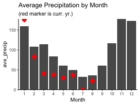
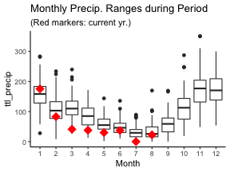
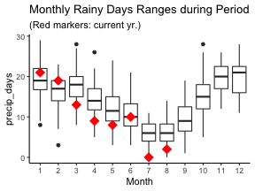
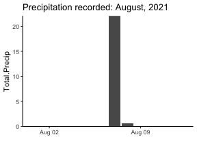
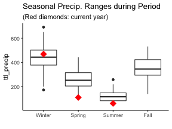
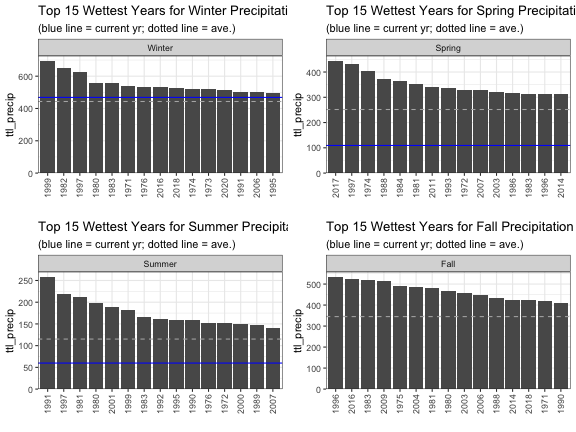
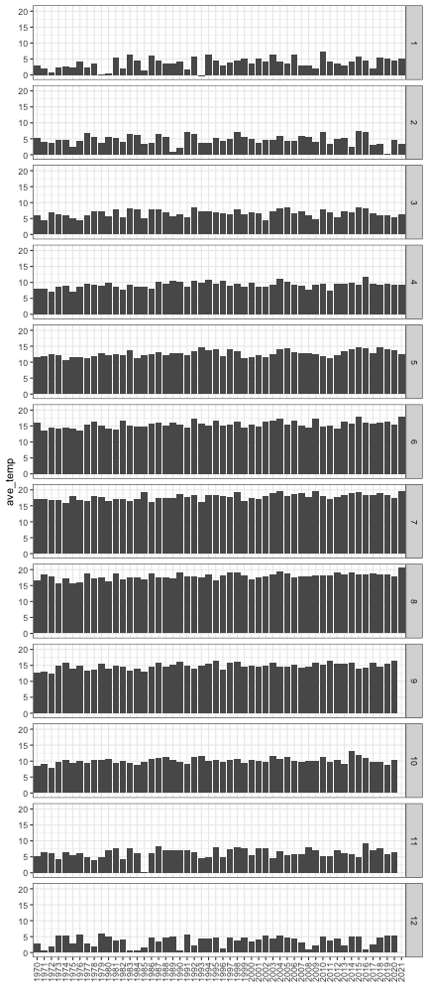
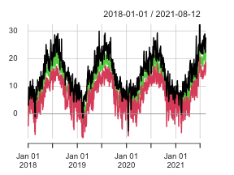

# Intro {.tabset}

Vancouver weather is all about the **rain**. Temperature is an afterthought. Wind rarely enters the picture. So weather discussions tend to be along the lines of **"this is the wettest September that I can remember"** or **"it has been such a wet winter"** or, for those who may know Vancouver only by reputation, **"isn't always rainy in Vancouver?"**

This is an exploration by someone who works with data but makes no claim to being a meteorologist or climatologist. All data here is taken directly from [Government of Canada website for historical weather data](https://climate.weather.gc.ca/historical_data/search_historic_data_e.html). 

There are **gaps** and mixture of **different weather stations** for continuity. This is **not an official or academic analysis**. It is offered for general information - your results may vary!

*Note: this is also a learning exercise in working with* [R statistical software](https://www.r-project.org/) *which is why there are buttons to reveal code for those interested.* [#rstats](https://twitter.com/hashtag/rstats)


Date range: **1970-01-01** to **2021-08-07** <br />
Precipitation units: **cm** <br />
Temperature units: **celsuis**

(More details available in the 'Sources' tab.)

## Mthly Precipitation 

### What is the average precipitation by month?

* How does this year compare with historical averages?


```r
## Monthly precipitation for each month, each year
vw.precip.mth.yr <- vw_data %>% mutate(precip.day=ifelse(Total.Precip>0,1,0)) %>% 
  group_by(Year, Month) %>%
  summarize(ttl_precip=sum(Total.Precip, na.rm=TRUE),
            precip_days=sum(precip.day, na.rm=TRUE))

## Group by month
vw.precip.mth <- vw.precip.mth.yr %>% group_by(Month) %>%
  summarize(ave_precip=mean(ttl_precip, na.rm=TRUE)) %>%
  mutate(pc_rank=percent_rank(ave_precip),
         pc=ave_precip/sum(ave_precip),
         rank=rank(desc(ave_precip)))

## filter for current year to overlay current year metrics on chart
vw.precip.mth.curr.yr <- vw.precip.mth.yr %>% filter(Year==year(Sys.Date()))
## need to have full 12 months for chart (even though some empty)
## get highest month with data in current year
fms <- max(as.numeric(vw.precip.mth.curr.yr$Month))+1
## create data frame for blank months
vw.precip.yr.future.mth <- data.frame(Year='2019',
                                      Month=c(fms:12),
                                       ttl_precip=NA,
                                      precip_days=NA)
## convert Month field in current yr from factor to integer for binding
vw.precip.mth.curr.yr$Month <- as.integer(vw.precip.mth.curr.yr$Month)
## add blank rows to current yr
vw.precip.mth.curr.yr <- bind_rows(vw.precip.mth.curr.yr,
                                    vw.precip.yr.future.mth) 

## CHART 1 
## Ave precip by month ####
chart.title <- "Average Precipitation by Month"
sub.title <- "(red marker is curr. yr.)"
ggplot(vw.precip.mth, aes(x=Month, y=ave_precip))+geom_col()+
  geom_point(data=vw.precip.mth.curr.yr, aes(x=Month, y=ttl_precip),shape=18, color='red', size=5)+
  scale_y_continuous(expand=c(0,0))+
  labs(title=chart.title, subtitle=sub.title)
```



* What is the order of months from wettest to driest?


```r
## Ave precip by month in order
chart.title <- "Months Ranked by Ave. Precipitation"
ggplot(vw.precip.mth, aes(x=reorder(Month, -ave_precip), y=ave_precip))+geom_col()+
  geom_hline(yintercept = mean(vw.precip.mth$ave_precip), linetype='dashed', color=color.line)+
  scale_y_continuous(expand=c(0,0))+
  labs(title=chart.title, subtitle = '(Dashed line is average)',
       x='month of year')
```


```r
## previously was heading and table - excluding now
#### Data by Month - ranked in order of highest precipitation
vw.precip.mth.rank <- vw.precip.mth %>% arrange(rank)
##vw.precip.mth.rank
```

### Monthly Preciptiation: Ranges

* Averages are limited: what is the **range in amount** of rain each month?


```r
## Range in precipitation by month ####
chart.title <- "Monthly Precip. Ranges during Period"
sub.title <- "(Red markers: current yr.)"
ggplot(vw.precip.mth.yr, aes(x=Month, y=ttl_precip))+geom_boxplot()+
  geom_point(data=vw.precip.mth.curr.yr, aes(x=Month, y=ttl_precip),shape=18, color='red', size=5)+
  labs(title=chart.title, subtitle=sub.title)
```



* How many *days* of rain are there each month?


```r
## Range in precip days by month
chart.title <- "Monthly Rainy Days Ranges during Period"
sub.title <- "(Red markers: current yr.)"
ggplot(vw.precip.mth.yr, aes(x=Month, y=precip_days))+geom_boxplot()+
  geom_point(data=vw.precip.mth.curr.yr, aes(x=Month, y=precip_days),shape=18, color='red', size=5)+
  labs(title=chart.title, subtitle=sub.title)
```



### Current Month Precipitation

* What's happening with rain so far this month?


```r
## get name of current month
#curr.mth <- month.name[month(Sys.Date())] ## current actual month
curr.mth <- month.name[month(max(vw_data$Date))] ## latest month in data

## get current (latest) month data
curr.mth.data <- vw_data %>% filter(Date>=floor_date(max(vw_data$Date), unit='months'))

## chart
chart.title <- paste0("Precipitation recorded: ",curr.mth,", ",year(max(vw_data$Date)))
curr.mth.data %>% ggplot(aes(x=Date, y=Total.Precip))+geom_col()+
  scale_y_continuous(limit=c(0,NA), expand=c(0,0))+
  labs(title=chart.title, x="")
```



* How does rain this month compare with same month in past years?


```r
## filter monthly data set for current month only
vw.precip.mth.curr <- vw.precip.mth.yr %>% filter(Month==month(max(vw_data$Date))) %>%
  arrange(desc(Year)) ## sort by year to get latest

## get recent years for current month precipitation
recentXyr <- 15
vw.precip.mth.curr.recent <- vw.precip.mth.curr[1:recentXyr,]
## chart
chart.title <- paste0(curr.mth, " Rain for each Year ")
sub.title <- paste0("(last ",recentXyr, " years - with ave.)")
ggplot(vw.precip.mth.curr.recent, aes(x=Year, y=ttl_precip))+geom_bar(stat='identity')+
  geom_hline(yintercept=mean(vw.precip.mth.curr.recent$ttl_precip), linetype='dashed', color=color.line)+
  scale_y_continuous(expand=c(0,0))+theme_classic()+
  labs(title=chart.title, subtitle=sub.title, x="")+
theme(axis.text.x  = element_text(angle=90, vjust=0.5))
```


```r
## show years in order of precipitation for current month
vw.precip.mth.curr <- vw.precip.mth.yr %>% filter(Month==month(Sys.Date())) %>%
  arrange(desc(ttl_precip)) ## sort by precipitation
topXyr <- 15
vw.precip.mth.curr.top <- vw.precip.mth.curr[1:topXyr,]

chart.title <- paste0(curr.mth, " Ranked by Precipitation (top ",topXyr," yrs)")
ggplot(vw.precip.mth.curr.top, aes(x=reorder(Year, -ttl_precip), y=ttl_precip))+geom_col()+
  geom_hline(yintercept = mean(vw.precip.mth.curr.top$ttl_precip), linetype='dashed', color=color.line)+
  scale_y_continuous(expand=c(0,0))+theme_classic()+
  labs(title=chart.title, subtitle='(Line is average)', x="")+
  theme(axis.text.x  = element_text(angle=90, vjust=0.5))
```


```r
## get percentiles for current mth - not used
vw.precip.mth.curr.pc <- vw.precip.mth.curr %>% ungroup() %>% arrange(ttl_precip) %>%
  #mutate(precip.pc=quantile(ttl_precip))
  mutate(precip.rank=rank(ttl_precip),
         precip.pc=precip.rank/max(precip.rank),
         cum.dist=cume_dist(ttl_precip),
         pc.rank=percent_rank(ttl_precip))
```

### Monthly Comparison YoY

For each month, what has been the pattern in precipitation over the years?


```r
## show each mth side-by-side YoY to see patterns, highs, lows

## facet_wrap is condensed but too many years to be able to read x axis
# ggplot(vw.precip.mth.yr, aes(x=Year, y=ttl_precip))+geom_bar(stat='identity')+
#   facet_wrap(Month~.)+
#   theme(axis.text.x  = element_text(angle=90, vjust=0.5))

## facet_grid is too wide and short unless re-sized
ggplot(vw.precip.mth.yr, aes(x=Year, y=ttl_precip))+geom_bar(stat='identity')+
  geom_hline(data=vw.precip.mth, aes(yintercept=ave_precip), linetype='dashed', color=color.line)+
  facet_grid(Month~.)+
  theme_bw()+
  theme(axis.text.x  = element_text(angle=90, vjust=0.5))+
  labs(x="")
```


## Seasonal Precip.

* What are the patterns in rain by season?

#### Season definitions:

* Winter: Dec, Jan, Feb
* Spring: Mar, Apr, May
* Summer: Jun, Jul, Aug
* Fall: Sep, Oct, Nov

*Note: the year for a winter season is applied to year at end of season. So winter from Dec 2018 to Feb 2019 is considered winter of 2019.*


```r
## Monthly precipitation for each season, each year
vw.precip.seas.yr <- vw_data %>% mutate(precip.day=ifelse(Total.Precip>0,1,0)) %>% 
  group_by(Season.Yr, Season) %>%
  summarize(ttl_precip=sum(Total.Precip, na.rm=TRUE),
            precip_days=sum(precip.day, na.rm=TRUE))

## Monthly summary data for each season
vw.precip.seas <- vw.precip.seas.yr %>% group_by(Season) %>%
  summarize(mean.precip=mean(ttl_precip),
          median.precip=median(ttl_precip),
          mean_precip_days=mean(precip_days),
          median.precip=median(precip_days))

## get current year seasonal data for comparison via dots
vw.precip.seas.yr.current <- vw.precip.seas.yr %>% filter(
 Season.Yr==year(Sys.Date())
)
```

* How much rain does Vancouver get in each season? How does this year compare?


```r
## Distribution of precipitation by season ####

## Range in precipitation by season ####
chart.title <- "Seasonal Precip. Ranges during Period"
sub.title <- "(Red diamonds: current year)"
ggplot(vw.precip.seas.yr, aes(x=Season, y=ttl_precip))+geom_boxplot()+
  geom_point(data=vw.precip.seas.yr.current, aes(x=Season, y=ttl_precip),shape=18, color='red', size=5)+
  labs(title=chart.title, subtitle=sub.title, x="")+theme_classic()
```



### Seasonal Precipitation Annual Ranking

* Need separate charts because each season ranked individually
* Line = median

* What are the wettest years for each season?


```r
## filter for each season and plot ranked years
## use facet as convenient way to label the chart with season
## reference line for median

fSeasPrecip <- function(seas){
## filter for season
vw.precip.s <- vw.precip.seas.yr %>% filter(Season==seas)
## setup for top yrs by precip
vw.precip.s.t <- data.frame(vw.precip.s)
top_precip <- 15 ## how many yrs to include
vw.precip.s.t <- vw.precip.s.t %>% slice_max(order_by=ttl_precip, n=top_precip)
vw.precip.s.t %>% ggplot(aes(x=reorder(Season.Yr, -ttl_precip), y=ttl_precip))+geom_col()
vw.precip.s.c <- vw.precip.seas.yr.current %>% filter(Season==seas)
## create chart
chart.title <- paste0("Top ",top_precip," Wettest Years for ", seas, " Precipitation")
sub.title <- "(blue line = current yr; dotted line = ave.)"
splot <- ggplot(vw.precip.s.t, aes(x=reorder(Season.Yr,-ttl_precip), y=ttl_precip))+
  geom_col()+
  ## can include bar for current yr BUT messes things up if not in top 15
  #geom_col(data=vw.precip.s.c, aes(x=as.factor(Season.Yr), y=ttl_precip), fill='blue')+ 
  geom_hline(yintercept=median(vw.precip.s$ttl_precip), linetype='dashed', color=color.line)+
  geom_hline(yintercept=vw.precip.s.c$ttl_precip[1], linetype='solid', color='blue')+
  scale_y_continuous(expand=expansion(mult=c(0,0.05)))+
  facet_grid(.~Season)+
  theme_bw()+
  theme(axis.text.x  = element_text(angle=90, vjust=0.5))+
  labs(title=chart.title, subtitle=sub.title, x="")
return(splot)
}

## winter
seas <- "Winter"
wplot <- fSeasPrecip(seas)
## spring
seas <- "Spring"
sgplot <- fSeasPrecip(seas)
## summer
seas <- "Summer"
smplot <- fSeasPrecip(seas)
## fall
seas <- "Fall"
fplot <- fSeasPrecip(seas)

grid.arrange(wplot, sgplot, smplot, fplot, nrow=2)
```



### Seasonal Precipitation by Year


```r
## show each season side-by-side YoY to see patterns, highs, lows

## facet_wrap is condensed but too many years to be able to read x axis
# ggplot(vw.precip.mth.yr, aes(x=Year, y=ttl_precip))+geom_bar(stat='identity')+
#   facet_wrap(Month~.)+
#   theme(axis.text.x  = element_text(angle=90, vjust=0.5))

## facet_grid is too wide and short unless re-sized
chart.title <- "Seasonal Precipitation by Year"
ggplot(vw.precip.seas.yr, aes(x=Season.Yr, y=ttl_precip))+geom_bar(stat='identity')+
  geom_hline(data=vw.precip.seas, aes(yintercept=mean.precip), linetype='dashed', color=color.line)+
  facet_grid(Season~.)+
  theme_bw()+
  theme(axis.text.x  = element_text(angle=90, vjust=0.5))+
  labs(title=chart.title, x="")
```


## Annual Temperature

What are Vancouver weather patterns for temperature?

### Check for missing data

* Data from the website is not always complete.
* Are there enough gaps that it is a concern?


```r
vw_na <- vw_data %>% filter(is.na(Max.Temp)|is.na(Min.Temp)|is.na(Mean.Temp))
vw_na %>% group_by(Year) %>% summarize(NAs=n()) %>% filter(NAs>1) %>% ggplot(aes(x=reorder(Year, NAs), y=NAs))+
  geom_col()+coord_flip()+
  scale_y_continuous(expand=expansion(mult=c(0,0.05)))+
  labs(title='Temperature NAs by Yr', x="")
```


```r
## can also check missing/non-missing by years with table
#table(vw_data$Year, is.na(vw_data$Mean.Temp))
```

* Something to watch for if there are suspicious results for years with higher NAs.
* Probbaly not going to be enough cause to throw whole year out. Could do some imputation of missing values, such as using averages, but probably not worth it.

### Ave. Annual Temperature

* What are the trends in average annual temperature?
* Does it looks like any evidence of climate change? (recognizing this is not an expert analysis)


```r
## get ave of mean, min, max daily temp by year
## first remove data from current yr if less than at least 9 mths data in yr
if(month(max(vw_data$Date))<10){
  vw.temp.yr <- vw_data %>% filter(as.numeric(as.character(Year))<max(as.numeric(as.character(vw_data$Year))))
} else {
  vw.temp.yr <- vw_data
}
## group by yr to get mean temps
vw.temp.yr <- vw.temp.yr %>% group_by(Year) %>% summarize(mean.mean=mean(Mean.Temp, na.rm=TRUE),                                 mean.min=mean(Min.Temp, na.rm=TRUE), mean.max=mean(Max.Temp, na.rm=TRUE))

## difference from most recent year to earliest
vw.temp.yr.diff <- vw.temp.yr
vw.temp.yr.diff$Year <- as.numeric(as.character(vw.temp.yr.diff$Year))
vw.temp.yr.diff <- vw.temp.yr.diff %>% filter(Year==min(Year)|Year==max(Year))
## - diff in temp
vw.temp.diff <- vw.temp.yr.diff[2,2]-vw.temp.yr.diff[1,2]
## - ave diff in temp
vw.temp.diff.ave <- vw.temp.diff[1]/(vw.temp.yr.diff[2,1]-vw.temp.yr.diff[1,1])

## line chart - note need group=1 so ggplot knows how to connect data points for line
chart.title <- 'Ave. Daily Temp by Year, with Trend'
ggplot(vw.temp.yr, aes(x=Year, y=mean.mean, group=1))+geom_line()+
  geom_smooth(method='lm')+theme_classic()+
  theme(axis.text.x  = element_text(angle=90, vjust=0.5))+
  labs(title=chart.title, y='Ave. Daily Temp', x='')
```


* 1985 looks like an outlier, although doesn't look like any NAs based on info above. 
* Overall, appears to be a legitimate trend in rising temperatures
    + **1.2078299** degrees celsius rise in temp from 1970 to 2020
    + **0.0241566** average temperature increase per yr
* This is **NOT an expert climatologist analysis**

#### Years Ranked by Average Daily Temp


```r
## get last yr data
vw.temp.yr.last <- vw.temp.yr %>% filter(Year==year(Sys.Date())-1)

## bar chart - years ranked in order of ave daily temp
chart.title <- 'Years in Order of Ave. Daily Temp. (excl. missing data)'
ggplot(vw.temp.yr, aes(x=reorder(Year, -mean.mean), y=mean.mean))+
  geom_col()+
  geom_col(data=vw.temp.yr.last, aes(x=Year, y=mean.mean), fill='blue')+
  scale_y_continuous(expand=c(0,0))+
  theme_classic()+
  theme(axis.text.x  = element_text(angle=90, vjust=0.5))+
  labs(title=chart.title,
       subtitle='Most recent yr in blue', y='Ave. Daily Temp', x='')
```


#### Linear model of annual temperature change


```r
vw.temp.yr <- vw.temp.yr %>% mutate(
  yr=as.character(Year),
  ynum=as.numeric(yr)
)
at.model <- lm(mean.mean~ynum, vw.temp.yr)

summary(at.model)
```

```
## 
## Call:
## lm(formula = mean.mean ~ ynum, data = vw.temp.yr)
## 
## Residuals:
##      Min       1Q   Median       3Q      Max 
## -1.11857 -0.35154 -0.08181  0.37167  0.97872 
## 
## Coefficients:
##               Estimate Std. Error t value Pr(>|t|)    
## (Intercept) -40.696232   9.434224  -4.314 7.75e-05 ***
## ynum          0.025561   0.004729   5.405 1.90e-06 ***
## ---
## Signif. codes:  0 '***' 0.001 '**' 0.01 '*' 0.05 '.' 0.1 ' ' 1
## 
## Residual standard error: 0.4971 on 49 degrees of freedom
## Multiple R-squared:  0.3736,	Adjusted R-squared:  0.3608 
## F-statistic: 29.22 on 1 and 49 DF,  p-value: 1.9e-06
```

```r
slope <- summary(at.model)$coefficients[2,1]
pval <- summary(at.model)$coefficients[2,4]

statsig <- ifelse(pval<0.05,'statistically significant','not statistically significant')
```

Model interpretation: <br />

* Average daily temperature changing 0.0255613 degrees each yr.
* P-value for statistical significance: 1.9003199 &times; 10<sup>-6</sup>
* Temperature change is *statistically significant* over this period
* **NOT a professional climatologist model** - may be issues with data or modeling process

#### Look at Average Daily Maximum and Minimums for each Year


```r
chart.title <- 'Ave. Daily Temp by Year, with Trend'
ggplot(vw.temp.yr, aes(x=Year, y=mean.mean, group=1))+
  geom_line()+
  geom_line(aes(y=mean.max))+
  geom_line(aes(y=mean.min))+
  geom_smooth(method='lm')+
  theme_classic()+
  theme(axis.text.x  = element_text(angle=90, vjust=0.5))+
  labs(title=chart.title, y='Ave. Daily Temp', x='')
```


Linear modelling for max and min


```r
at.model <- lm(mean.max~ynum, vw.temp.yr)

summary(at.model)
```

```
## 
## Call:
## lm(formula = mean.max ~ ynum, data = vw.temp.yr)
## 
## Residuals:
##      Min       1Q   Median       3Q      Max 
## -0.93137 -0.31669  0.04908  0.35331  1.05209 
## 
## Coefficients:
##              Estimate Std. Error t value Pr(>|t|)    
## (Intercept) -26.70626    9.67652   -2.76 0.008110 ** 
## ynum          0.02032    0.00485    4.19 0.000116 ***
## ---
## Signif. codes:  0 '***' 0.001 '**' 0.01 '*' 0.05 '.' 0.1 ' ' 1
## 
## Residual standard error: 0.5099 on 49 degrees of freedom
## Multiple R-squared:  0.2638,	Adjusted R-squared:  0.2488 
## F-statistic: 17.56 on 1 and 49 DF,  p-value: 0.0001159
```

```r
slope <- summary(at.model)$coefficients[2,1]
pval <- summary(at.model)$coefficients[2,4]

statsig <- ifelse(pval<0.05,'statistically significant','not statistically significant')
```

Model interpretation: <br />

* Average daily MAX temperature changing 0.0203237 degrees each yr.
* P-value for statistical significance: 1.1591193 &times; 10<sup>-4</sup>
* Temperature change is *statistically significant* over this period
* **NOT a professional climatologist model** - may be issues with data or modeling process


```r
at.model <- lm(mean.min~ynum, vw.temp.yr)

summary(at.model)
```

```
## 
## Call:
## lm(formula = mean.min ~ ynum, data = vw.temp.yr)
## 
## Residuals:
##      Min       1Q   Median       3Q      Max 
## -1.30279 -0.33628  0.01533  0.40626  1.11347 
## 
## Coefficients:
##               Estimate Std. Error t value Pr(>|t|)    
## (Intercept) -54.658877   9.791662  -5.582 1.02e-06 ***
## ynum          0.030762   0.004908   6.268 9.04e-08 ***
## ---
## Signif. codes:  0 '***' 0.001 '**' 0.01 '*' 0.05 '.' 0.1 ' ' 1
## 
## Residual standard error: 0.5159 on 49 degrees of freedom
## Multiple R-squared:  0.445,	Adjusted R-squared:  0.4337 
## F-statistic: 39.28 on 1 and 49 DF,  p-value: 9.036e-08
```

```r
slope <- summary(at.model)$coefficients[2,1]
pval <- summary(at.model)$coefficients[2,4]

statsig <- ifelse(pval<0.05,'statistically significant','not statistically significant')
```

Model interpretation: <br />

* Average daily MIN temperature changing **0.030762** degrees each yr.
* P-value for statistical significance: **9.0363811 &times; 10<sup>-8</sup>**
* Temperature change is *statistically significant* over this period

## Mthly Temp.

### Monthly average temperature


```r
## Monthly precipitation for each month, each year
vw.temp.mth.yr <- vw_data %>% 
  group_by(Year, Month) %>%
  summarize(ave_temp=mean(Mean.Temp, na.rm=TRUE),
            ave_max_temp=mean(Max.Temp, na.rm=TRUE),
            ave_min_temp=mean(Min.Temp, na.rm=TRUE),
            max_temp=max(Max.Temp, na.rm=TRUE),
            min_temp=min(Min.Temp, na.rm=TRUE))

#is.nan(vw.temp.mth.yr$ave_max_temp)
#vw.temp.mth.yr %>% filter(max_temp==-Inf)
## need to clean up missing values
## even with na.rm used above, if there are only NA for a given month, 
##  it will return NaN for mean and Inf or -Inf for min/max
## clean up
vw.temp.mth.yr <- vw.temp.mth.yr %>% mutate(
  ave_temp=ifelse(is.nan(ave_temp),NA,ave_temp),
  ave_max_temp=ifelse(is.nan(ave_max_temp),NA,ave_max_temp),
  ave_min_temp=ifelse(is.nan(ave_min_temp),NA,ave_min_temp),
  max_temp=ifelse(max_temp==-Inf|max_temp==Inf,NA, max_temp),
  min_temp=ifelse(min_temp==-Inf|min_temp==Inf,NA, min_temp)
)

## Monthly average temp across years
vw.temp.mth <- vw.temp.mth.yr %>% group_by(Month) %>%
  summarize(ave_temp=mean(ave_temp, na.rm=TRUE),
            ave_max_temp=mean(ave_max_temp, na.rm=TRUE),
            ave_min_temp=mean(ave_min_temp, na.rm=TRUE)) %>%
  mutate(pc_rank=percent_rank(ave_temp),
         rank=rank(desc(ave_temp)))

## filter for current year to overlay current year metrics on chart
vw.temp.mth.curr.yr <- vw.temp.mth.yr %>% filter(Year==year(Sys.Date()))
## need to have full 12 months for chart (even though some empty)
## get highest month with data in current year
fms <- max(as.numeric(vw.temp.mth.curr.yr$Month))+1
## create data frame for blank months
vw.temp.yr.future.mth <- data.frame(Year=year(Sys.Date()),
                                      Month=c(fms:12))
## convert Month field in current yr from factor to integer for binding
vw.temp.mth.curr.yr$Year <- as.integer(vw.temp.mth.curr.yr$Year)
vw.temp.mth.curr.yr$Month <- as.integer(vw.temp.mth.curr.yr$Month)

## add blank rows to current yr
vw.temp.mth.curr.yr <- bind_rows(vw.temp.mth.curr.yr,
                                    vw.temp.yr.future.mth) 

## Ave temp by month ####
chart.title <- "Average Temp. Month (blue is ave. min/max; red marker is curr. yr.)"
ggplot(vw.temp.mth, aes(x=Month, y=ave_temp))+geom_col()+
  geom_errorbar(aes(ymin=ave_min_temp, ymax=ave_max_temp), width=.2,
                 position=position_dodge(.9), color='blue')+
  geom_point(data=vw.temp.mth.curr.yr, aes(x=Month, y=ave_temp),shape=18, color='red', size=5)+
  scale_y_continuous(expand=c(0,0))+
  ggtitle(chart.title)+labs(x="")
```


```r
## Ave precip by month in order
chart.title <- "Months Ranked by Ave. Temp"
ggplot(vw.temp.mth, aes(x=reorder(Month, -ave_temp), y=ave_temp))+geom_col()+
  ggtitle(chart.title)+labs(x="")
```


### Monthly Temperatures: Ranges


```r
## Distribution of temperature by month ####

## Range in temperature by month ####
chart.title <- "Monthly Temp. Ranges during Period (Red markers: current yr.)"
ggplot(vw.temp.mth.yr, aes(x=Month, y=ave_temp))+geom_boxplot()+
  geom_point(data=vw.temp.mth.curr.yr, aes(x=Month, y=ave_temp),shape=18, color='red', size=5)+
  ggtitle(chart.title)+labs(x="")
```


### Monthly Temperature Trends over Years


```r
## annual trends in month-by-month temp
chart.title <- "Ave. Mthly Temps. All Years"
## need to convert Month to integer for line chart
vw.temp.mth.yr$Month <- as.integer(vw.temp.mth.yr$Month)
## set chart to variable for use with plotly
plot.mth.yr <- ggplot(vw.temp.mth.yr, aes(x=Month, y=ave_temp, color=Year))+geom_line()+scale_x_continuous(breaks=c(1:12))+
  theme_classic()+ggtitle(chart.title)
## use plotly for interaction such as highlight specific years
ggplotly(plot.mth.yr)
```

```
## Error in path.expand(path): invalid 'path' argument
```

### Monthly Temp. Comparison YoY

For each month, what has been the pattern in ave. temperature over the years?


```r
## show each mth side-by-side YoY to see patterns, highs, lows

## facet_wrap is condensed but too many years to be able to read x axis
# ggplot(vw.precip.mth.yr, aes(x=Year, y=ttl_precip))+geom_bar(stat='identity')+
#   facet_wrap(Month~.)+
#   theme(axis.text.x  = element_text(angle=90, vjust=0.5))

## facet_grid is too wide and short unless re-sized
ggplot(vw.temp.mth.yr, aes(x=Year, y=ave_temp))+geom_col()+
  facet_grid(Month~.)+
  theme_bw()+
  theme(axis.text.x  = element_text(angle=90, vjust=0.5))+
  labs(x="")
```



## Seasonal Temp.

Charts coming soon! Or at least eventually. ;)

#### Season definitions:

* Winter: Dec, Jan, Feb
* Spring: Mar, Apr, May
* Summer: Jun, Jul, Aug
* Fall: Sep, Oct, Nov

*Note: the year for a winter season is applied to year at end of season. So winter from Dec 2018 to Feb 2019 is considered winter of 2019.*

## Records

### Precipitation

What are the wettest days on record?


```r
## chart by date - alternative consideration
# vw_data %>% slice_max(order_by=Total.Precip, n=5) %>% select(Date, Max.Temp, Min.Temp, Total.Precip) %>% ggplot(aes(x=Date, y=Total.Precip))+geom_col()+
#   scale_y_continuous(expand=expansion(mult=c(0,0.05)))

nrec <- 5
chart.title <- glue("Top ",nrec," Days by Total Precipitation")
vw_data %>% slice_max(order_by=Total.Precip, n=nrec) %>% select(Date, Total.Precip, Station) %>%
  ggplot(aes(x=reorder(as.character(Date), Total.Precip), 
             y=Total.Precip, label=Total.Precip, fill=Station))+geom_col()+
  geom_text(hjust=0, size=4, nudge_y=0.5)+
  coord_flip()+
  scale_y_continuous(expand=expansion(mult=c(0,0.1)))+
  labs(title=chart.title, x="", y="Single Day Precipitation (cm)")
```


What are the wettest months on record?


```r
nrec <- 5
chart.title <- glue("Top ",nrec," Months by Total Precipitation")

## ungroup needed for slice_max to work
vw.precip.mth.yr %>% ungroup() %>% mutate(
  Year_Mth=paste0(as.character(Year),"-",as.character(Month)) 
) %>% select(Year_Mth, ttl_precip) %>% 
  slice_max(order_by=ttl_precip, n=nrec) %>% 
  ggplot(aes(x=reorder(Year_Mth, ttl_precip), 
             y=ttl_precip, label=ttl_precip))+geom_col()+
  geom_text(hjust=0, size=4, nudge_y=0.5)+
  coord_flip()+
  scale_y_continuous(expand=expansion(mult=c(0,0.1)))+
  labs(title=chart.title, x="", y="Single Day Precipitation (cm)")
```


### Temperature

What are the hottest days on record?


```r
nrec <- 5
## set metric to be used for filtering and other manipulation
## applied by referring to: 
##  get(metric) - simpler, more intuitive but doesn't always seem to work
##  !!sym(metric) - ugly, complicated, works
metric <- 'Max.Temp'
chart.title <- glue("Hottest ",nrec," Days by Temperature")
metric <- 'Max.Temp'

vw_data %>% slice_max(order_by=get(metric), n=nrec) %>% select(Date, !!sym(metric), Station) %>%
  ggplot(aes(x=reorder(as.character(Date), get(metric)), 
             y=get(metric), label=get(metric), fill=Station))+geom_col()+
  geom_text(hjust=0, size=4, nudge_y=0.5)+
  coord_flip()+
  scale_y_continuous(expand=expansion(mult=c(0,0.1)))+ ## reversing axis order for readability
  labs(title=chart.title, x="", y=paste0(metric," (c)"))
```


What are the coldest days on record?


```r
nrec <- 5
## set metric to be used for filtering and other manipulation
## applied by referring to: 
##  get(metric) - simpler, more intuitive but doesn't always seem to work
##  !!sym(metric) - ugly, complicated, works
metric <- 'Min.Temp'

chart.title <- glue("Coldest ",nrec," Days by Temperature")
vw_data %>% slice_min(order_by=get(metric), n=nrec) %>% select(Date, !!sym(metric), Station) %>%
  ggplot(aes(x=reorder(as.character(Date), -get(metric)), 
             y=get(metric), label=get(metric), fill=Station))+geom_col()+
  geom_text(hjust=0, size=4, nudge_y=0.5)+
  coord_flip()+
  scale_y_reverse(expand=expansion(mult=c(0,0.1)))+ ## reversing axis order for readability
  labs(title=chart.title, x="", y="Min. Temp (c)")
```


## Sources

All source code and data used is available in my Github repo: <br />
[proj-r-van-weather](https://github.com/jyuill/proj-r-van-weather)

### Govt of Canada Historical Weather data

Data is collected from Govt of Canada website:

http://climate.weather.gc.ca/historical_data/search_historic_data_e.html

The following weather stations are represented. Not the preferred approach but I couldn't find continuous data for any single weather station.
`

```r
## stations
vw_stn <- vw_data %>% select(Station, Year) %>% mutate(
  Year=as.numeric(levels(vw_data$Year))[Year]
) 

vw_stn %>% ggplot(aes(x=Station, y=Year))+geom_point()+
  coord_flip()+theme_classic()+
  labs(title='Weather Stations',x='')
```


Data is available from the government website on a daily basis and updated occasionally here. Date range currently covered:

**Earliest date:** *1970-01-01* <br />
**Most recent date:** *2021-08-07* <br />

### Data Structure

Check data structure and summary:


```r
str(vw_data)
```

```
## spec_tbl_df [18,846 × 11] (S3: spec_tbl_df/tbl_df/tbl/data.frame)
##  $ Date        : Date[1:18846], format: "1970-01-01" "1970-01-02" "1970-01-03" "1970-01-04" ...
##  $ Year        : Factor w/ 52 levels "1970","1971",..: 1 1 1 1 1 1 1 1 1 1 ...
##  $ Month       : Factor w/ 12 levels "1","2","3","4",..: 1 1 1 1 1 1 1 1 1 1 ...
##  $ Day         : num [1:18846] 1 2 3 4 5 6 7 8 9 10 ...
##  $ Season      : Factor w/ 4 levels "Winter","Spring",..: 1 1 1 1 1 1 1 1 1 1 ...
##  $ Season.Yr   : num [1:18846] 1970 1970 1970 1970 1970 1970 1970 1970 1970 1970 ...
##  $ Max.Temp    : num [1:18846] 6.1 2.2 5 2.8 1.7 5.6 3.3 4.4 7.2 5.6 ...
##  $ Min.Temp    : num [1:18846] -1.7 0 -1.7 -3.3 -2.8 -1.7 -3.3 0 2.8 -2.8 ...
##  $ Mean.Temp   : num [1:18846] 2.2 1.1 1.7 -0.3 -0.6 2 0 2.2 5 1.4 ...
##  $ Total.Precip: num [1:18846] 0 1 0.5 0 0 0 0 4.6 6.6 0.5 ...
##  $ Station     : chr [1:18846] "VANCOUVER INT'L A" "VANCOUVER INT'L A" "VANCOUVER INT'L A" "VANCOUVER INT'L A" ...
##  - attr(*, "spec")=
##   .. cols(
##   ..   Date = col_date(format = ""),
##   ..   Year = col_double(),
##   ..   Month = col_double(),
##   ..   Day = col_double(),
##   ..   Season = col_character(),
##   ..   Season.Yr = col_double(),
##   ..   Max.Temp = col_double(),
##   ..   Min.Temp = col_double(),
##   ..   Mean.Temp = col_double(),
##   ..   Total.Precip = col_double(),
##   ..   Station = col_character()
##   .. )
```

```r
summary(vw_data)
```

```
##       Date                 Year           Month           Day           Season       Season.Yr       Max.Temp    
##  Min.   :1970-01-01   1972   :  366   1      :1612   Min.   : 1.00   Winter:4661   Min.   :1970   Min.   :-8.70  
##  1st Qu.:1982-11-25   1976   :  366   3      :1612   1st Qu.: 8.00   Spring:4784   1st Qu.:1982   1st Qu.: 8.90  
##  Median :1995-10-20   1980   :  366   5      :1612   Median :16.00   Summer:4760   Median :1995   Median :13.40  
##  Mean   :1995-10-20   1984   :  366   7      :1612   Mean   :15.72   Fall  :4641   Mean   :1995   Mean   :13.85  
##  3rd Qu.:2008-09-12   1988   :  366   8      :1588   3rd Qu.:23.00                 3rd Qu.:2008   3rd Qu.:19.00  
##  Max.   :2021-08-07   1992   :  366   10     :1581   Max.   :31.00                 Max.   :2021   Max.   :34.40  
##                       (Other):16650   (Other):9229                                                NA's   :46     
##     Min.Temp         Mean.Temp       Total.Precip      Station         
##  Min.   :-15.200   Min.   :-11.50   Min.   : 0.000   Length:18846      
##  1st Qu.:  2.800   1st Qu.:  6.00   1st Qu.: 0.000   Class :character  
##  Median :  6.800   Median : 10.10   Median : 0.000   Mode  :character  
##  Mean   :  6.718   Mean   : 10.31   Mean   : 3.209                     
##  3rd Qu.: 11.300   3rd Qu.: 15.20   3rd Qu.: 3.600                     
##  Max.   : 22.400   Max.   : 28.40   Max.   :91.600                     
##  NA's   :39        NA's   :48       NA's   :54
```

* Looks like quite a few NAs for temp and precip; as long as they are spread out, shouldn't be a problem

#### Check Data Relationships

* uses PerformanceAnalytics package


```r
chart.Correlation(vw_data[,c(7:10)], histogram = TRUE)
```


* Looks like temperatures are highly correlated and precipitation has weak negative correlation with temperate (colder weather slightly more associated with rain)

#### Temperature Time Series

Just for fun.


```r
## time series chart from Performance Analytics pkg - alternative to ggplot2
vw_ts <- data.frame(vw_data)
vw_ts$Year <- as.numeric(as.character(vw_ts$Year))

num_yrs <- 3
vw_ts <- vw_ts %>% filter(Year>=year(Sys.Date())-num_yrs)
row.names(vw_ts) <- vw_ts$Date
chart.TimeSeries(vw_ts[,c(7,8,9), drop=FALSE])
```


